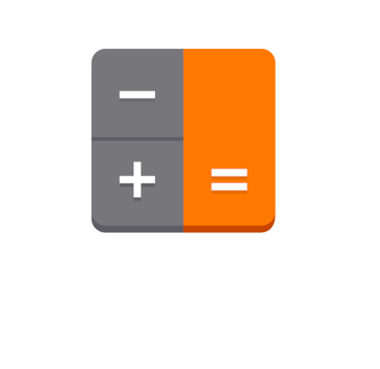

   

## about
This project is a calculator, built using HTML, CSS and JavaScript. The idea behind the calculator is to provide a functional and intuitive tool to perform basic mathematical operations directly in the browser.

## main Features
* Basic Operations: Addition, subtraction, multiplication and division.

* Intuitive Interface: Clean and organized design for easy use by anyone.

* Responsiveness: The calculator is designed to work well on devices of different sizes, from desktops to smartphones.

 ## attention
 For test the calculator just click on the image or click in that link <a href="https://iamlucasmagalhaes.github.io/calc.js/" style = "text-decoration: underline;">Calc.js</a>